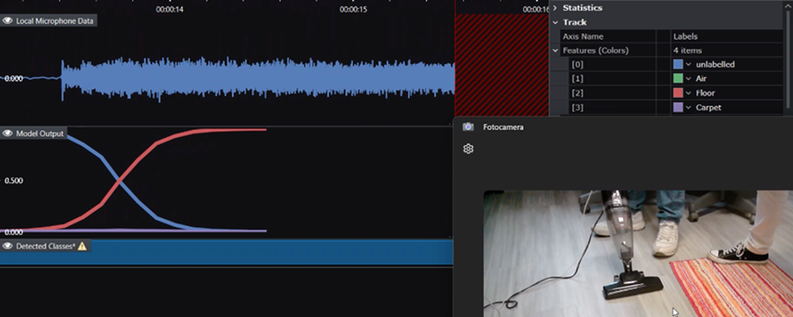
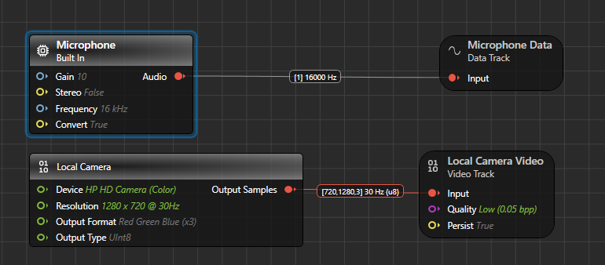
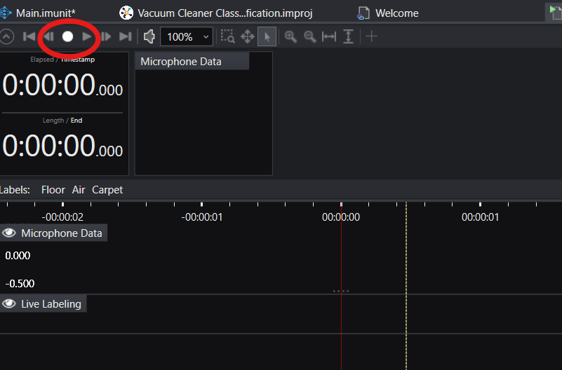

# Surface Detection for Vacuum Cleaners - Starter Model Project

## Use-case description

This starter model offers a framework to develop a **surface detection project** for recognizing different surfaces (Floor, Carpet, or Air) based on sound patterns generated by a vacuum cleaner. The goal is to enable classification of these surfaces by analyzing the vacuum cleaner's audio signals as it operates.

The project is designed for use with a simple and inexpensive vacuum cleaner, but the methodology can be adapted to other models or machinery with similar sound-based differentiation characteristics.

This is a **classification project**, a type of Supervised Learning where the system categorizes data into distinct classes. In this project, the three classes are Floor, Carpet, and Air.

### How can I know if this project fits my use case?

This project is suitable if:

- You aim to identify or classify different surfaces based on the noise signature of a vacuum cleaner or similar machinery.
- You can collect data representing the behavior of the vacuum cleaner across all target surface types (Floor, Carpet, Air).

If you cannot gather sufficient data for all three surface types, or if the audio signals of your machine do not vary significantly across those surfaces, this approach may yield less accurate results.

### How can this project ease my go-to-production journey?

This starter project provides a streamlined approach to build a surface detection machine learning model. By using this as your starting point, you’ll gain access to:

- A pre-configured framework to perform surface classification based on audio signals.
- Built-in preprocessing and data windowing settings.
- Predefined model architectures optimized for this task, which can be deployed easily.

## Contents

`Data` - Folder for storing your audio dataset.

`Models` - Folder for saving trained models, predictions, and edge-deployable code.

`Units` - Folder for adding custom layers or preprocessors (not used in this project).

`Tools` - Folder containing data collection utilities.

`Tools/DataCollectionGraphUX` - Includes a data collection project using GraphUX, enabling efficient data acquisition.

## Sensor settings specification

This project requires the [PSOC™ 6 AI Evaluation Kit](https://www.infineon.com/cms/en/product/evaluation-boards/cy8ckit-062s2-ai/), which includes a PSoC™ 6 MCU and Infineon digital microphones. The kit is ideal for prototyping, enabling real-world data collection to rapidly develop machine learning solutions.

While this project uses a vacuum cleaner, the methodology can be adapted to other machinery or setups. If you want to replicate the functionality out-of-the-box, you can follow the provided steps.

## Collecting and expanding the dataset

To gather new data, you must flash and configure the [Imagimob Streaming Protocol Firmware](https://github.com/Infineon/mtb-example-imagimob-streaming-protocol/blob/master/README.md) on your PSoC™ 6 AI Kit. Refer to the firmware's README for setup instructions.

To initiate data collection with GraphUX, open the `Tools/DataCollectionGraphUX` directory and double-click the `Main.imunit` file. Ensure that the PSOC™ 6 AI Kit is connected to your computer via USB, then configure and start the data collection pipeline.

Adjust the input parameters in the "Microphone" block to match these settings. Note that you can also configure the webcam input to collect video stream. This is useful if you want a visual clue to label the data after having collected it.

Click the "Start" button in GraphUX to execute the pipeline, and then use the "Record" button to capture microphone data:

Save the recorded data into the `Data` folder or another directory of your choice. Ensure you collect sufficient data for each target class (Floor, Carpet, Air) to train a robust model.

### A note on data labeling

This project uses three labels corresponding to the three surface types:

- **Floor**: Indicates that the vacuum cleaner is operating on a hard floor surface.
- **Carpet**: Indicates operation on a carpeted surface.
- **Air**: Indicates that the vacuum cleaner is not in contact with any surface (e.g., lifted off the ground).

**Important:** Ensure accurate labeling of your data, as incorrect labels will adversely affect the model’s performance.

## Recommended path to production

### Step-by-step guide:

1. **Identify the vacuum cleaner or machinery you want to monitor.**
   - Ensure that it produces distinct noise signatures for each surface type.
   - Test its operation across the three target classes (Floor, Carpet, Air).

2. **Collect and label data for a prototype model.**
   - Use the GraphUX project to collect at least 40 minutes of data per surface type.
   - Save the data in the `Data` folder and label it accurately. You may increase the dataset size if initial model performance is unsatisfactory.

3. **Train the prototype model in Deepcraft Studio.**
   - Import your dataset into the "Data" tab of the `.improj` file in Deepcraft Studio.
   - Follow the standard Deepcraft Studio workflow to preprocess, train, and evaluate your classification model.
   - The pre-configured preprocessing settings and model architectures are optimized for real-time performance on the PSoC™ 6 AI Kit.

4. **Deploy and test the model in real-time.**
   - Use the template application in ModusToolbox ([MTB Example ML Imagimob MTBML Deploy](https://github.com/Infineon/mtb-example-ml-imagimob-mtbml-deploy)) to deploy the trained model firmware onto the PSoC™ 6 AI Kit.
   - Conduct real-time surface detection tests by connecting the vacuum cleaner to the evaluation board.

5. **Optimize for production deployment.**
   - Transition from the prototype to a finalized production setup by placing the sensors and MCU in their intended positions within the vacuum cleaner housing.
   - Collect additional data if the production setup differs significantly from the prototype conditions. Use the Transfer Learning capabilities in Deepcraft Studio to fine-tune the model for the final configuration.

6. **Monitor and maintain the system post-deployment.**
   - Establish procedures for ongoing monitoring, model updates, and system maintenance based on your production requirements.

## Help & Support

For detailed tutorials and additional resources, visit [developer.imagimob.com](https://developer.imagimob.com). If you require further assistance with deploying the model or troubleshooting issues, contact support at [support@imagimob.com](mailto:support@imagimob.com).
